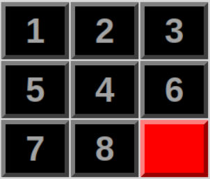
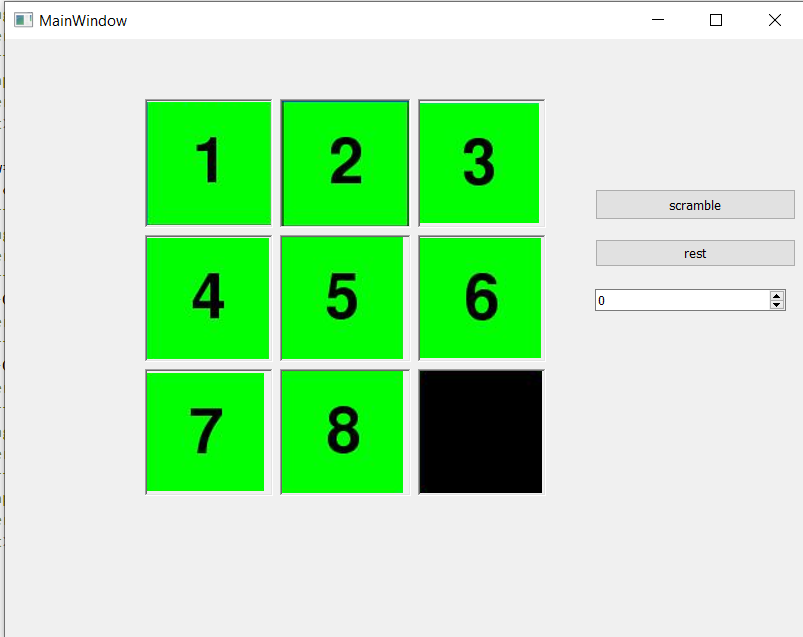

<div id="top"></div>


<!-- PROJECT LOGO -->
<br />
<div align="center">
    
  
</div>


<!-- TABLE OF CONTENTS -->
<details>
  <summary>Table of Contents</summary>
  <ol>
        <li><a href="#introduction">Introduction</a></li>
        <li><a href="#Presentation-of-the-project">Presentation of the project</a></li>
        <li><a href="#Steps-to-realise-the-project">Steps to realise the project</a></li>
        <li><a href="#conclusion">Conclusion</a></li>
        
  </ol>
</details>

- # [Introduction](#Introduction)
 Qt provides widjet and console application programming, wich facilitate the conception of multiple concepts of applications. We will foucus on our work on QtWidjet class and it elements
 
- # [Presentation of the project](#Presentation-of-the-project)

##  **In our Application we have :**


 
 
## **the application looks like that :**
<p align="center">
     
   </p>

  - ## [Steps to realise the project](#Steps-to-realise-the-project)
    - ### [the headers](#the-headers)
    - ### [the cpp](#the-cpp)
    - ### [the form](#the-form)
   
   # Steps to realise the project
## the-headers
 ### board widget.h
  #### Functions
```c++
class BoardWidget : public QWidget

{
    Q_OBJECT
public:
    explicit BoardWidget(PuzzleBoard *board,bool locked = false, int img =  0, QWidget *parent = 0);
    void set_curr_board(PuzzleBoard*);
    ~BoardWidget();

signals:
protected:
    void paintEvent(QPaintEvent *);
    void mousePressEvent(QMouseEvent *);
public slots:
    void change_image(int img);
    void lock_board(bool lock);
signals:
    void piece_moved();
private:
    void load_images();
    PuzzleBoard *m_board;
    QPainter *m_painter;
    QVector<QImage> m_pieces_image;
    int m_pieces_size;
    int m_img_index;
    bool m_locked;
};

```
 ### puzzle board.h
  #### Functions
 ```c++
enum DIRECTIONS { RIGHT = 0, LEFT, UP, DOWN, BLOCKED };

class PuzzlePiece{
public:
    PuzzlePiece(int x = 0, int y = 0, int value = 0, int dir = BLOCKED);
    int m_pos_x;
    int m_pos_y;
    int m_value;
    int m_movable_dir;
    void operator=(PuzzlePiece*);
};

typedef std::vector<PuzzlePiece> Board;
typedef std::vector<PuzzlePiece>::const_iterator Board_Const_Iter;
typedef std::vector<PuzzlePiece>::iterator Board_Iter;

class PuzzleBoard
{
public:
    PuzzleBoard(int board_size = 3);
    ~PuzzleBoard();

    PuzzlePiece* piece(int x, int y);
    void update_board();
    void move_piece(int x, int y);
    int check_piece_mov(int x, int y);
    std::vector<PuzzlePiece*> get_movable_pieces();
    int get_size();
    const Board* get_board();
    void set_board(PuzzleBoard*);
    bool compare_boards(PuzzleBoard*);
    void scramble_board_with_moves(int num_moves = 100);
    void calculate_unique_id();
    QString* get_unique_id();
private:

    int m_board_size;
    Board m_board;
    QString m_unique_id;
};

    
```
## widget.h
   #### Functions
```c++
class Widget : public QWidget
{
    Q_OBJECT

public:
    explicit Widget(QWidget *parent = nullptr);

    ~Widget();

public slots:

    void start();
    void scramble();
    void setup_board();
    void reset();
private slots:
    void on_backfromselectpic_clicked();
    void on_nexttogame_clicked();

private:

    void connect_slots();
    Ui::Widget *ui;
    BoardWidget *m_puzzle_widget;
    PuzzleBoard *m_board;
    PuzzleBoard *m_goal;
};

 ``` 
##  the Cpp
  ### board widget.cpp
  #### Functions

 ```c++
 BoardWidget::BoardWidget(PuzzleBoard *board,bool locked,int img, QWidget *parent) :
    QWidget(parent)
{
    m_board = board;
    m_painter = new QPainter();
    m_img_index = img;
    load_images();
    m_locked = locked;
}

BoardWidget::~BoardWidget(){
    delete m_painter;
    m_pieces_image.clear();
}


void BoardWidget::load_images(){
    int size = m_board->get_size();
    QImage image;
    QString img_path;
    QString type;


    switch(m_img_index){
        case 0:
            img_path = ":/Images/awesome";
            type = ".jpg";
            break;
        case 1:
            img_path = ":/Images/troll_face";
            type = ".png";
            break;
        case 2:
            img_path = ":/Images/rage";
            type = ".jpg";
            break;
        case 3:
            img_path = ":/Images/classic";
            type = ".png";
            break;
        case 4:
            img_path = ":/Images/gray";
            type = ".png";
            break;
        case 5:
            img_path = ":/Images/red";
            type = ".jpg";
            break;
        case 6:
            img_path = ":/Images/orange";
            type = ".png";
            break;
        case 7:
            img_path = ":/Images/rupp";
            type = ".png";
            break;
        case 8:
            img_path = ":/Images/ited";
            type = ".png";
             break;
        case 9:
            img_path = ":/Images/tb";
            type = ".png";
            break;
       case 10:
            img_path = ":/Images/me";
             type = ".png";
              break;
    }

    switch(size){
    case 3:
        img_path.append("3x3");
        break;
    case 4:
        img_path.append("4x4");
        break;
    case 5:
        img_path.append("5x5");
        break;
    }
    img_path.append(type);
    image.load(img_path);
    m_pieces_image.clear();                     //board size
    m_pieces_image.resize(size*size);
    for(int i = 0; i < size; i++){
         for(int j = 0; j < size; j++){
          m_pieces_image[i + (size*j)] = image.copy(QRect(i*SQUARE_SIZE,j*SQUARE_SIZE,SQUARE_SIZE,SQUARE_SIZE));
         }
    }
    update();
}


void BoardWidget::lock_board(bool lock){
    m_locked = lock;
}


void BoardWidget::change_image(int img){
    m_img_index = img;
    m_pieces_image.clear();
    load_images();
}


void BoardWidget::paintEvent(QPaintEvent *e){
    m_painter->begin(this);
    QPen gap_pen;
    gap_pen.setColor(QColor(200,200,200));
    m_painter->setBackgroundMode(Qt::OpaqueMode);
    int board_size = m_board->get_size();
    int image_index = 0;
    for(int i = 0; i < board_size; i++){
        for(int j = 0; j < board_size; j++){
            image_index = m_board->piece(i,j)->m_value-1;
            if(m_board->piece(i,j)->m_value==0){
                m_painter->fillRect(i*SQUARE_SIZE,j*SQUARE_SIZE,SQUARE_SIZE,SQUARE_SIZE,gap_pen.brush());
            }else{
               m_painter->drawImage(QRect(SQUARE_SIZE*i,SQUARE_SIZE*j,SQUARE_SIZE,SQUARE_SIZE),m_pieces_image[image_index]);
               m_painter->drawLine(i*SQUARE_SIZE,j*SQUARE_SIZE,board_size*SQUARE_SIZE,j*SQUARE_SIZE);
               m_painter->drawLine(i*SQUARE_SIZE,j*SQUARE_SIZE,i*SQUARE_SIZE,board_size*SQUARE_SIZE);
            }
        }
    }
    m_painter->drawLine(0,board_size*SQUARE_SIZE,board_size*SQUARE_SIZE,board_size*SQUARE_SIZE);
    m_painter->drawLine(board_size*SQUARE_SIZE,0,board_size*SQUARE_SIZE,board_size*SQUARE_SIZE);
    m_painter->end();
}

void BoardWidget::mousePressEvent(QMouseEvent *e){
    if(!m_locked){
        int mouse_x;
        int mouse_y;
        mouse_x = e->x();
        mouse_y = e->y();
        m_board->move_piece(mouse_x / SQUARE_SIZE, mouse_y / SQUARE_SIZE);
        emit piece_moved();
        update();
    }
}


void BoardWidget::set_curr_board(PuzzleBoard *board){
    this->m_board = board;
    update();
}


```
   ### puzzle board.cpp
  #### Functions
   ```c++
 PuzzlePiece::PuzzlePiece(int x, int y, int value, int dir){
    m_pos_x = x;
    m_pos_y = y;
    m_value = value;
    m_movable_dir = dir;
}

PuzzleBoard::PuzzleBoard(int board_size)
{
    m_board_size = board_size;
    PuzzlePiece *new_piece = NULL;
    int value = 0;
    for(int i = 0; i < m_board_size; i++){
        for(int j = 0; j < m_board_size; j++){
            value = (i + j*m_board_size)+1;

            new_piece = new PuzzlePiece(i,j, value, BLOCKED);

            m_board.push_back(*new_piece);

            delete new_piece;
            new_piece = NULL;
        }
    }
    m_board[(m_board_size*m_board_size)-1].m_value = 0;
    update_board();
}

PuzzleBoard::~PuzzleBoard(){
    m_unique_id.clear();
    m_board.clear();
}

PuzzlePiece* PuzzleBoard::piece(int x, int y){
    if((x >= 0) && (x < m_board_size) && (y>=0) && (y < m_board_size))
    {
        return &m_board[x*m_board_size + y];
    }
    else
    {
        return  NULL;
    }
}

void PuzzleBoard::scramble_board_with_moves(int num_moves){

    srand(time(NULL));
    std::vector<PuzzlePiece*> movable_pieces;
    PuzzlePiece *curr_piece;
    int piece_num = 0;
    for(int i = 0; i < num_moves; i++){
        movable_pieces = this->get_movable_pieces();
        piece_num = rand() % movable_pieces.size();
        curr_piece = movable_pieces[piece_num];
        this->move_piece(curr_piece->m_pos_x,curr_piece->m_pos_y);
        movable_pieces.clear();
    }
    return;
}

void PuzzleBoard::update_board(){
    for(int i = 0; i < m_board_size; i++){
        for(int j = 0; j < m_board_size; j++){
            if(piece(i,j)->m_value == 0){
                piece(i,j)->m_movable_dir = BLOCKED;
            }else{
                piece(i,j)->m_movable_dir = check_piece_mov(i,j);
            }
        }
    }
    calculate_unique_id();
    return;
}
void PuzzleBoard::move_piece(int x, int y){
    PuzzlePiece *temp_piece = NULL;
    PuzzlePiece *curr_piece = NULL;
    int backup_value = 0;
    int direction = check_piece_mov(x,y);
    curr_piece = piece(x,y);
    if((direction != BLOCKED) && (curr_piece->m_value != 0)){
        switch(direction){
        case LEFT:
            temp_piece = piece(x-1,y);
            break;
        case RIGHT:
            temp_piece = piece(x+1,y);
            break;
        case UP:
            temp_piece = piece(x,y-1);
            break;
        case DOWN:
            temp_piece = piece(x,y+1);
            break;
        default:
            break;
        }
        backup_value = curr_piece->m_value;
        curr_piece->m_value = temp_piece->m_value;
        temp_piece->m_value = backup_value;
        update_board();
    }
 ```
  
  ## widget.h
   #### Functions
    ```c++
    
    void Widget::reset(){

    ui->size_spinBox->setEnabled(true);
    ui->comboBox->setEnabled(true);
    ui->scramble_pushButton->setEnabled(true);
    setup_board();
    m_puzzle_widget->lock_board(false);}
```
```c++

   void Widget::start(){

    ui->size_spinBox->setEnabled(false);
    ui->comboBox->setEnabled(false);
    ui->scramble_pushButton->setEnabled(false);
    ui->reset_pushButton->setEnabled(false);
    m_puzzle_widget->lock_board(true);}
```
```c++
void Widget::scramble(){

    m_board->scramble_board_with_moves();
    m_puzzle_widget->set_curr_board(this->m_board);}
```

```c++
void Widget::on_backfromselectpic_clicked()
{
    int index = ui->stackedWidget->currentIndex();
    ui->stackedWidget->setCurrentIndex(index-1);}
```

```c++
void Widget::on_nexttogame_clicked()
{
    int index = ui->stackedWidget->currentIndex();
    ui->stackedWidget->setCurrentIndex(index+1);
    reset();}
  ```
  ## the form:
   #### our Maiwindow GUI
 
    <div align="center">
    
  
    </div>

  
 

 
 


Our Team -[DARBAL nour-elhouda](https://github.com/teamkhaoulanour) -[MZOUDI Khaoula](https://github.com/KhaoulaMzoudi) -[Kenza Youssi](https://github.com/)

Project Link: [Puzzle Game](https://https://github.com/Darbal-Nour-elhouda/puzzle-game/edit/main/README.md)

Encadré par : [Mr.Belcaid Anass](https://)


<p align="right">(<a href="#top">back to top</a>)</p>
